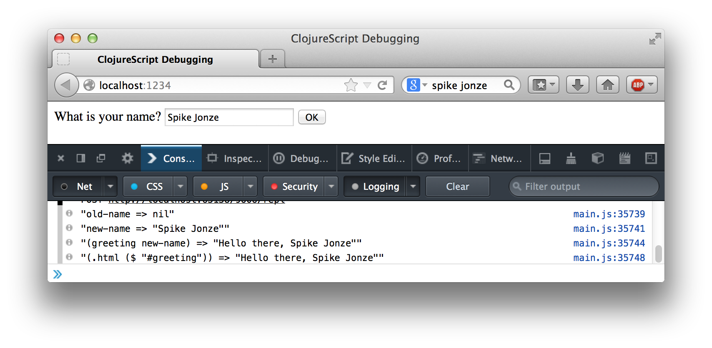
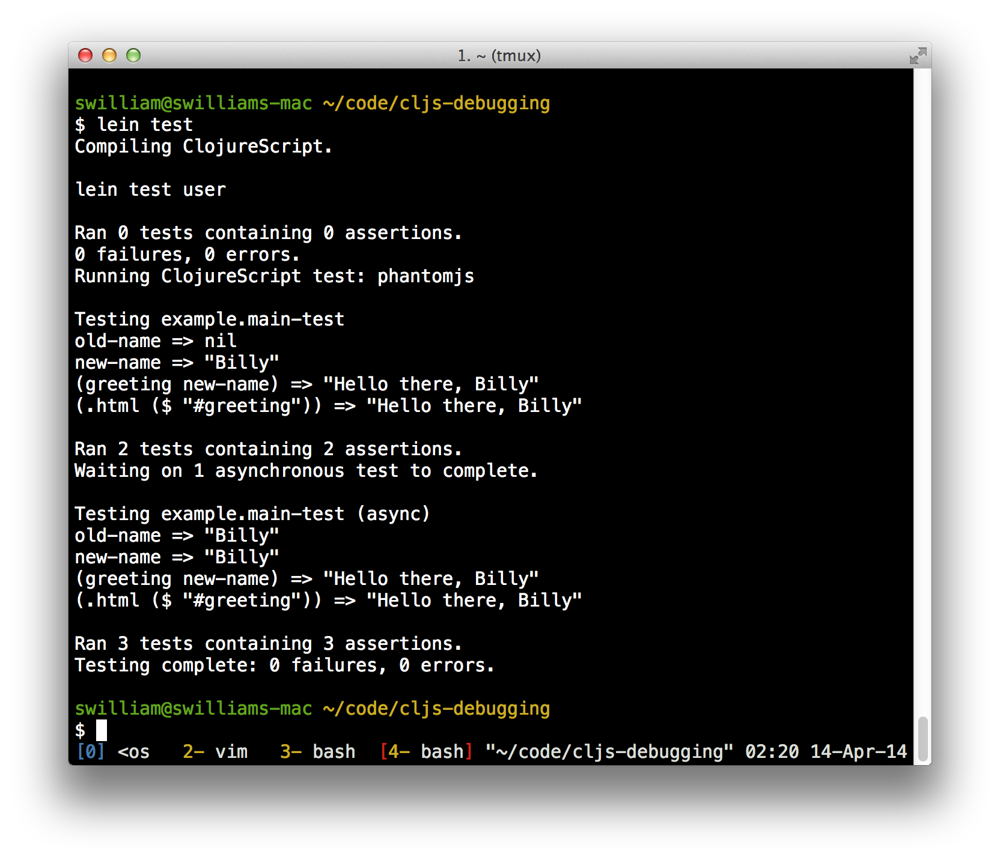
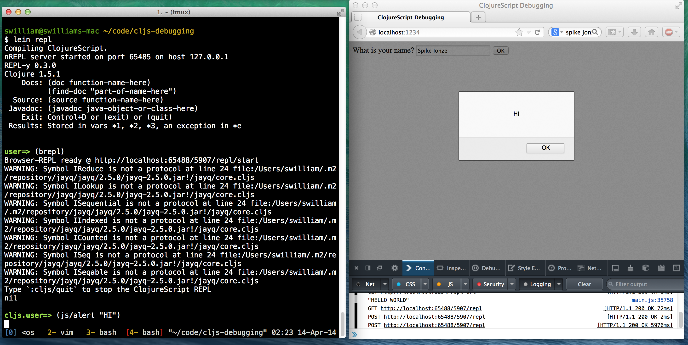

# ClojureScript Debugging

I want to share some ClojureScript debugging practices that I find helpful.
This project provides a simple web app example intended for studying/practicing
the following debugging workflow:

- __Logging__ - easily and descriptively log your application state
- __Testing__ - quickly test your code without opening a web browser
- __Interacting__ - play with your code while it's running on your web page
- __Tracing__ - pause and step through code

## Setup

1. Install [Leiningen](http://leiningen.org/), [NodeJS](http://nodejs.org/), and [PhantomJS](http://phantomjs.org/).
1. Run the following in the project directory:

    ```
    npm install express
    node server
    ```

1. In another terminal, run the auto-compiler from the project directory:

    ```
    lein cljsbuild auto
    ```

1. Open <http://localhost:1234> in your browser.


## Logging

The easiest way to debug your application is to log messages to the browser console:

```clojure
(js/console.log "b =>" (pr-str b))
```

`pr-str` serializes the given clojure value into a string for easy viewing.

To make this even easier, this project includes an `inspect` macro that prints any number of values:

```clojure
(inspect a)
; prints:
;   a => 1

(inspect a b c (+ 1 2 3))
; prints:
;   a => 1
;   b => :foo-bar
;   c => ["hi" "world"]
;   (+ 1 2 3) => 6
```

You can see the result of the `inspect` calls in the browser console:



## Testing

It's nice having the ability to test your code without opening a browser.  The
following command runs all the tests contained in the test/ directory:

```
lein test
```

It will run three tests and print the following:



### Pure Function Testing

It is simple to create a test case that verifies the output of a function:

```clojure
(deftest greeting
  (is (= "Hello there, Bob" (main/greeting "Bob"))))
```

### DOM Testing

You can test a function's side effects on the DOM as well.  Just keep in mind
that by default, the PhantomJS test runner is evaluating all your code in the
context of a blank DOM page.

```clojure
(deftest greeting-drawn

  ; Create the DOM element.
  (-> ($ "<div id='greeting'></div>")
      (.appendTo "body"))

  ; Test DOM side effect when modifying atom.
  (reset! main/username "Billy")
  (is (= "Hello there, Billy"
         (.html ($ "#greeting"))))

  ; Remove DOM element from test environment.
  (-> ($ "#greeting")
      (.remove)))
```

So if you're testing a simple function that only touches a few DOM elements, you
can create those DOM elements in the test.

For more complex DOM tests, you could reconfigure the PhantomJS runner to start
with an existing page rather than a blank one.  The default test command running
tests on a blank page can be seen in `project.clj`:

```clojure
:test-commands {"phantomjs" ["phantomjs" :runner
                             "public/js/jquery-1.9.1.min.js"
                             "public/js/main.js"]}
```

The `:runner` keyword is expanded to [the default runner
script](https://github.com/cemerick/clojurescript.test/blob/master/resources/cemerick/cljs/test/runner.js),
which can be replaced with a custom script for opening test pages with a
preconfigured DOM, or even for directly running the web app as is.

### Asynchronous Tests

You can also test asynchronous functions by making your test
wait for a callback.  Asynchronous test functions must have:

- the metadata `^:async` before the function name
- a call to `(done)` to signify when the test is done

```clojure
(deftest ^:async greeting-clear

  ; Create the DOM element.
  (-> ($ "<div id='greeting'></div>") (.appendTo "body"))

  ; Make sure DOM greeting is cleared after 2 seconds.
  (js/setTimeout
    (fn []
      (is (= "" (.html ($ "#greeting")))) ; check if clear
      (-> ($ "#greeting") (.remove))      ; remove DOM element
      (done))                             ; exit test
    2000))
```

## Interacting

If you want to interact with the web app's code while it is running, you
can hook up an interactive ClojureScript prompt (REPL) to a browser session
displaying your page:

1. From the terminal at your project directory, run:

    ```
    lein repl
    ```

    ```clojure
    (brepl)
    ```

1. Open <http://localhost:1234> in your browser.
1. Go back to the terminal and run:

    ```clojure
    (js/alert "hello")
    ```

1. If you don't see an alert window on the browser. Refresh the page.  You should see this:




### Trying things

Type the following to enter the project's namespace under main.

```clojure
(ns example.main)
```

You can set the value of the `username` atom with the following.

```clojure
(reset! username "me")
```

You can inspect the value of that atom too:

```clojure
@username
```

If you want to use other symbols, like the JQuery `$` function:

```clojure
(ns example.main (:require [jayq.core :refer [$]]))
```

Now you can inspect the value of the greeting in the DOM.

```clojure
(.html ($ "#greeting"))
```

If all goes well, you should see "Hello there, me" on the web page too.

## Source Maps

```
lein with-profile debug-extra cljsbuild auto
```

